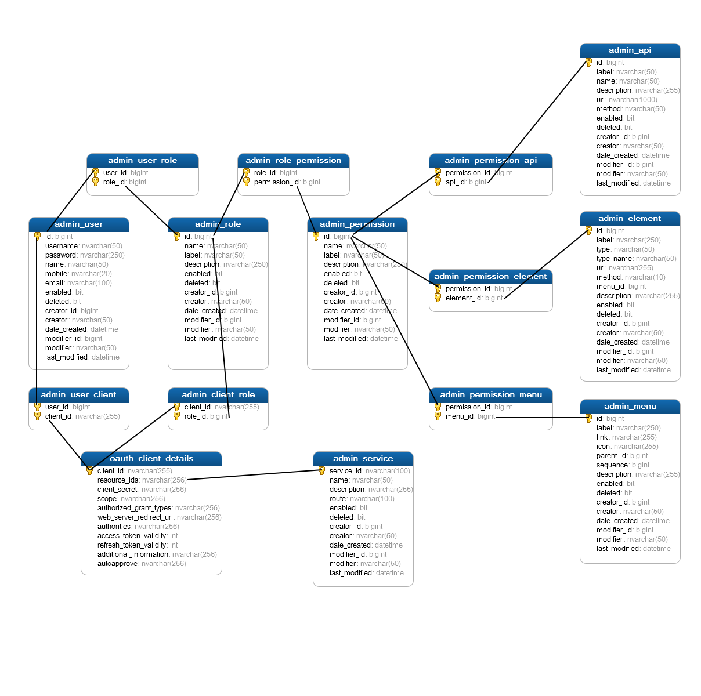
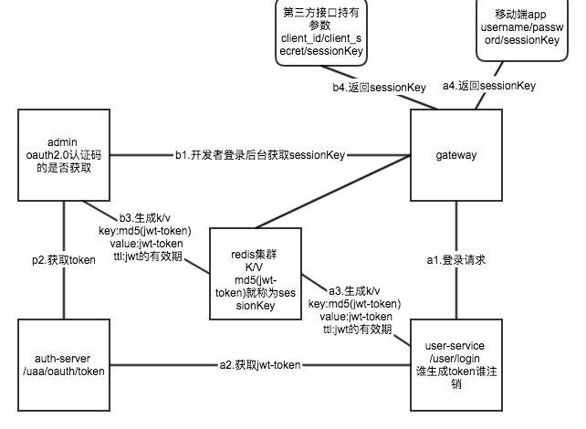
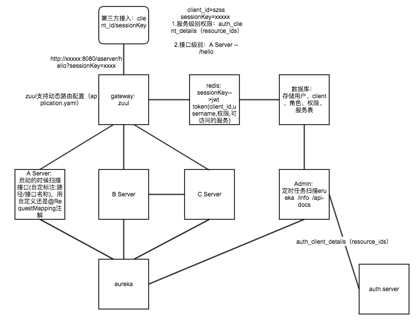
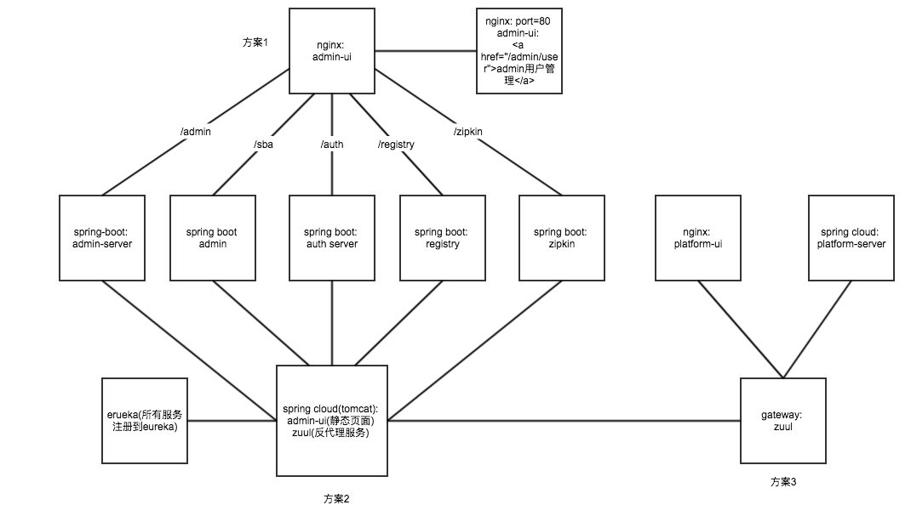
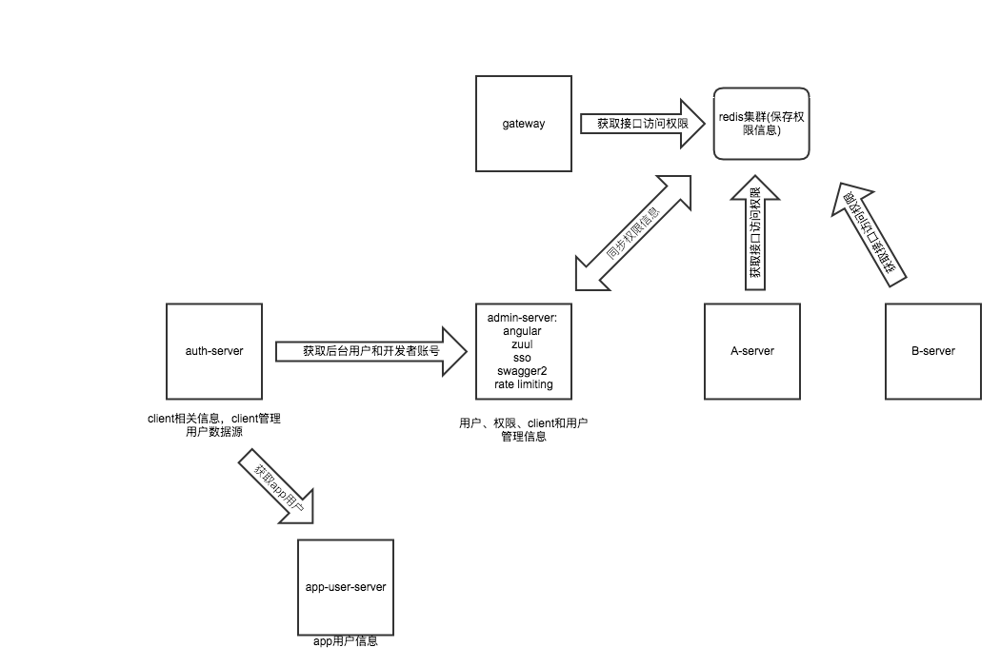

# 1 项目结构
```
├─marge-cloud
│  │  
│  ├─marge-auth------------------------------------认证服务
│  |  ├─marge-auth-server--------------------------认证服务服务端(oauth2.0、jwt)
│  |  ├─marge-auth-client--------------------------认证服务客户端
│  │ 
│  ├─marge-monitor---------------------------------监控
│  |  ├─marge-monitor-admin------------------------spring boot admin监控(env,metrics,dump,jolokia,info,configprops,trace,logfile,refresh,flyway,liquibase,heapdump,loggers,auditevents,hystrix.stream)
│  |  ├─marge-monitor-zipkin-----------------------zipkin监控
|  |  ├─marge-monitor-elastic-job-console----------elastic job任务监控
|  |
│  ├─marge-registry--------------------------------注册服务(包含erueka、config)
|  |
|  ├─marge-gateway---------------------------------网关服务

```


# 2 需求和设计
```
- 1.内部服务使用JWT做为token的实现，JWT更加轻巧，在微服务之间进行访问鉴权已然足够，并且可以避免在流转过程中和身份认证服务打交道
2.外部客户端调用使用sessionKey，是外部客户端使用的token,所谓的sessionKey就是session数据的key
3.请求进入网关后，网关通过sessionKey从redis集群(session存储)获取对应的内部服务的JWT(Json Web Token)
4.每个第三方接口分配一个开发者账号和client_id/client_secret
5.第三方接口的sessionKey由开发者通过登录管理界面获取，只能通过认证码authorization_code的方式来获取，并且对token进行md5签名作为sessionKey保存到redis集群
- 6.app使用username和password参数访问登录接口，登录接口内置client_id和client_secret，使用client和username这两组参数从oauth服务器获取token,token需要转换成sessionKey，这样app具有用户注销功能
- 7.登录时用户密码后台程序不做加密处理，全部有前段程序进行加密，后端程序只接受加密后的密码
8.client对象隶属于user对象，并且client对象(auth_client_details表)的权限字段设置角色
9.系统服务标示service_id有marge-admin服务通过erueka服务获取，再结合具体服务的/info接口获取其他辅助信息，如网关路由前缀
10.系统权限信息使用annotation进行标注并提供解析接口，或者使用swagger2的/api-docs接口由marge-admin服务进行动解析保存到库中，需要包含权限和接口信息
11.统一网关服务需要有限流、熔断、路由动态更新、监控、签名等功能
- 12.集成spring boot admin监控，监控内容包含env,metrics,dump,jolokia,info,configprops,trace,logfile,refresh,flyway,liquibase,heapdump,loggers,auditevents,hystrix.stream
- 13.marge-registry集成eureka
- 14.marge-registry集成config
15.集成zipkin
- 16.marge-admin-ui需要集成zuul、前端页面,调用marge-registry密码加密接口多密码进行加密处理，用户权限对象的操作日志
17.marge-admin集成swagger2，所有的服务接口文档通过swagger2文档展示
18.集成日志服务（ELK）

```

```
1.用户和角色的绑定在用户管理的新增和修改页面操作
2.用户新增是否是开发者属性
3.角色、权限添加类型属性，区分是接口和菜单类型
4.用户关联的角色为菜单角色权限
5.client关联的角色为接口角色权限
6.用户和client关联，用户必须是开发者账号，该client用于三方调用接口，通过oauth认证码方式获取token，和天猫京东接口sessionkey获取类似
7.client可以绑定用户，也可以不绑定，绑定用户必须是开发者账号。不绑定的情况为app、小程序或者后台管理界面使用
8.client添加属性是否可以被开发者绑定
9.在client管理里面绑定开发者，如果client类型是可绑定类型
10.用户详情页面需要展示关联角色/权限信息，关联的client信息(可访问的服务和服务权限)
11.client详情页面需要展示关联的开发者信息，以及服务信息，角色和权限信息
12.服务管理展示服务详细信息展示
13.服务添加属性是否是有UI界面
14.权限添加所属服务属性
15.api、菜单、页面元素添加所属UI服务属性
16.日志管理记录在在什么时间点修改什么数据，日志的新增使用AOP实现
17.marge auth server添加userdetails.clients配置信息的查看页面
```

```
1.config加密功能使用证书
2.auth服务的token key使用证书
3.admin ui登录直接进首页的问题
4.admin ui首次登录后没有菜单数据，刷新页面后才会出现菜单，并且用户数据变为模板默认用户数据
```

**admin库表关系图**



**sessionkey和token转换以及注销.png**




**网关和服务间鉴权.png**



**静态页面和服务架构设计.png**



**auth设计并兼容odin项目.png**




# 3 参考文章
- [微服务架构下的安全认证与鉴权](https://mp.weixin.qq.com/s/x0CZpovseOuofTA_lw0HvA)